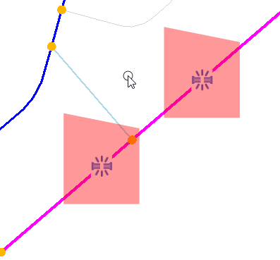

# Shaded Polygon



Suppose you you have some object with a polygon 'zone' around it. For example, a pipe break, with an outage zone around it in some water network.
With the [`drawFunc`](https://www.imodeljs.org/reference/imodeljs-frontend/views/marker/drawfunc/) method override for imodeljs
[Markers](https://www.imodeljs.org/reference/imodeljs-frontend/views/marker/),
you can draw that zone polygon.

With `useMarker`, you simply pass your implementation for the method override as an option. There, you can use the HTML5 2D canvas directly, and draw your polygon

```tsx
import React from "react";
import { useMarker } from "@bentley/imodeljs-react-hooks";
import { IModelApp } from "@bentley/imodeljs-frontend";
import { Point3d } from "@bentley/geometry-core";

interface Props {
  breakPt: Point3d;
  outageZonePts: Point3d[];
}

const MyZone = (props: Props) => {
  useMarker({
    worldLocation: breakPt,
    drawFunc(ctx) {
      const vp = IModelApp.viewManager.getFirstOpenView();
      if (vp) {
        const breakInView = vp.worldToView(breakPt);
        if (!vp.viewRect.containsPoint(breakInView)) return;
        // the canvas is setup is to draw relative to the marker's location in the view
        // so our polygon's view pts must be offset by the position of the break in the view
        const outageZoneOffsetsInView = outageZonePts.map((pt) =>
          vp.worldToView(pt).minus(breakInView)
        );
        const [first, ...rest] = outageZoneOffsetsInView;
        ctx.fillStyle = "rgba(255, 0, 0, 0.4)";
        ctx.beginPath();
        ctx.moveTo(first.x, first.y);
        for (const p of rest) ctx.lineTo(p.x, p.y);
        ctx.closePath();
        ctx.fill();
      }
    },
  });

  return null;
};
```

If you want to have the pipebreak inside the same marker (like in the featured image), you can add the `image` and `size` options.
If you want the zone to be selectable, you'll need a custom override of [`pick`](https://www.imodeljs.org/reference/imodeljs-frontend/views/marker/)
which does the polygon containment testing.
